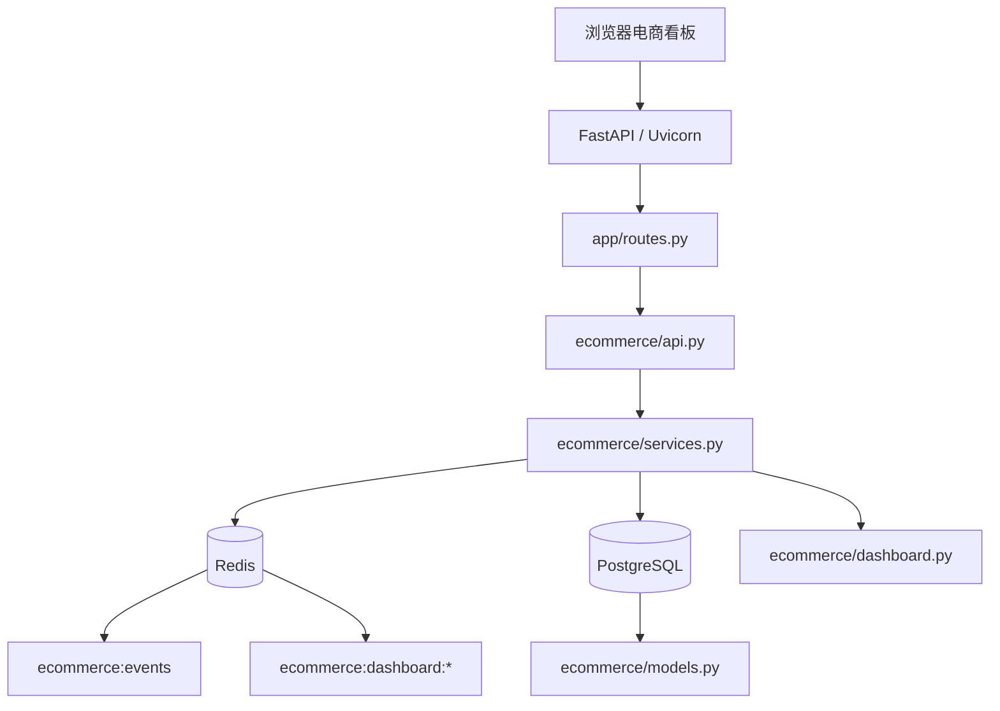
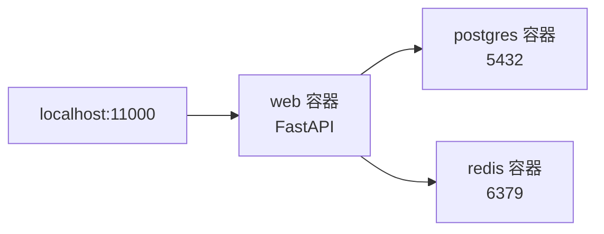
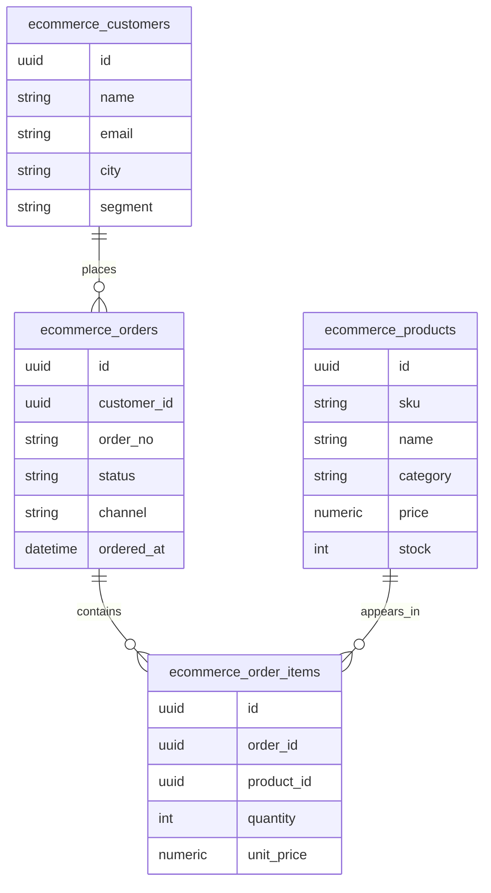
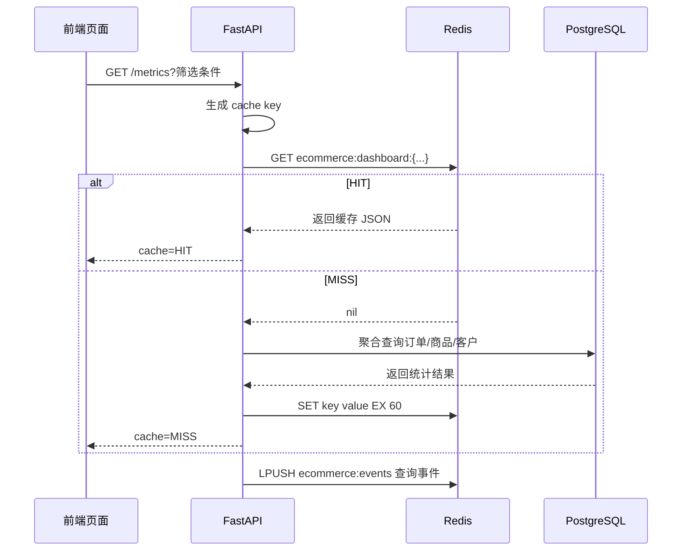
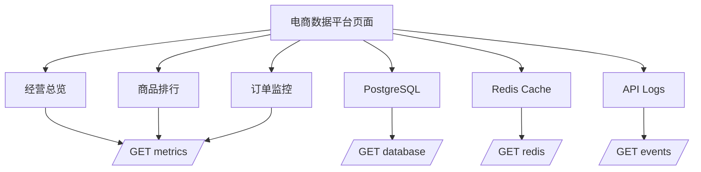
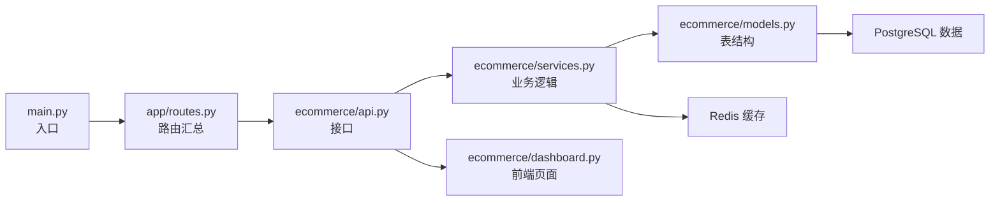

# fastapi-commerce-lab 可视化学习地图

## 1. 总体架构

## 2. Docker 服务图

## 3. 电商数据表关系

## 4. Redis HIT / MISS 流程

## 5. 页面视图映射

## 6. 学习路线

## 7. 最重要的观察点

- 第一次相同筛选条件：`CACHE MISS`
- 第二次相同筛选条件：`CACHE HIT`
- `Redis Cache` 页面看 key、TTL、value 预览
- `API Logs` 页面看事件顺序
- `PostgreSQL` 页面看表数据量和聚合结果
