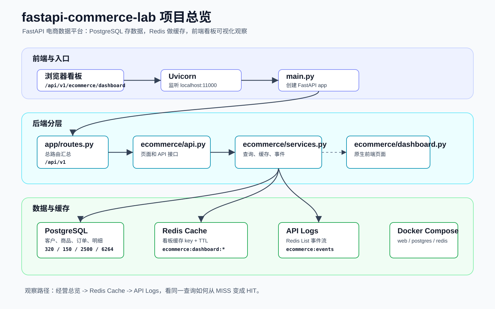
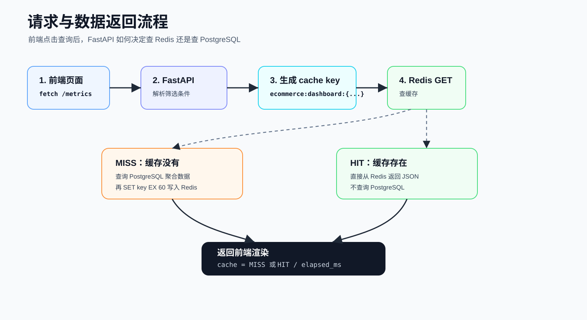
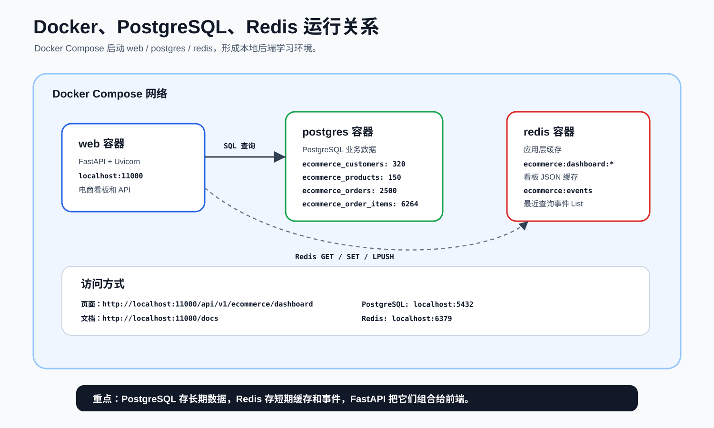
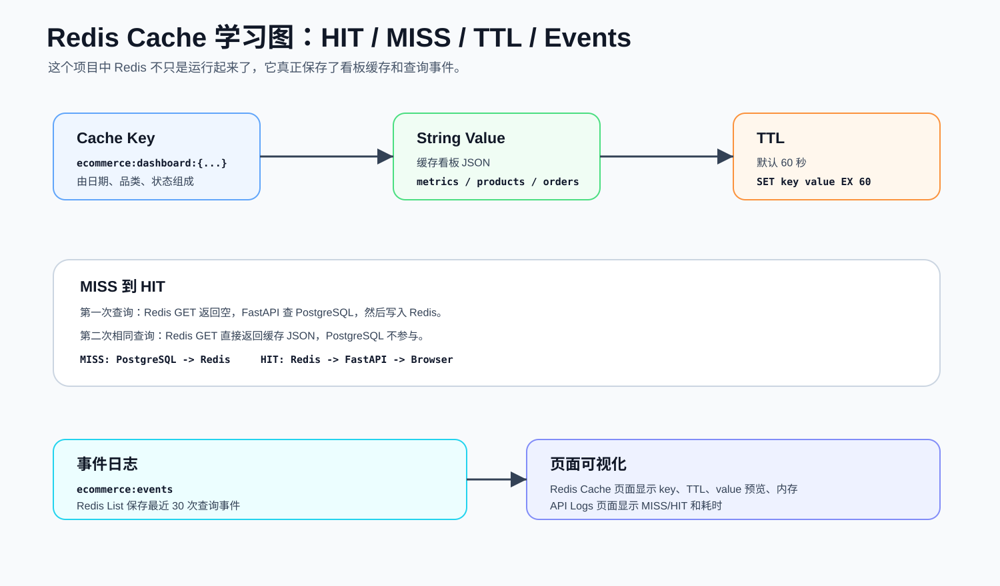

# fastapi-commerce-lab

A FastAPI learning project for an ecommerce analytics dashboard with PostgreSQL, Redis caching, Docker, and API visualization.

这是一个基于 FastAPI 模板扩展出来的学习项目。它保留了原有后端工程分层，并新增了一个电商数据平台，用来学习：

- FastAPI 项目结构
- PostgreSQL 数据建模与聚合查询
- Redis 缓存命中与未命中
- Docker Compose 服务编排
- Swagger API 文档
- 简单前端页面如何调用后端 API

## 功能概览

- 电商经营总览页面
- 商品排行
- 订单监控
- PostgreSQL 数据库可视化
- Redis key / TTL / 内存 / 缓存流程可视化
- API Logs，观察 `MISS -> HIT`
- 自动初始化演示电商数据

## 项目可视化图表

这些图表可以帮助初学者快速理解：这个项目有哪些模块、一次请求怎样经过 FastAPI / Redis / PostgreSQL，以及 Docker 容器之间如何协作。

### 1. 项目整体结构



### 2. 前端请求到后端返回数据的流程



### 3. Docker、FastAPI、PostgreSQL、Redis 的关系



### 4. Redis 缓存 HIT / MISS 流程



## 技术栈

| 类型 | 技术 |
| --- | --- |
| Web 框架 | FastAPI |
| Web 服务器 | Uvicorn |
| 数据库 | PostgreSQL |
| 缓存 | Redis |
| ORM | SQLAlchemy |
| 迁移工具 | Alembic |
| 容器 | Docker Compose |
| 前端 | 原生 HTML / CSS / JavaScript |

## 快速运行

确保 Docker Desktop 已启动。

```powershell
cd D:\A_Proj_test\fastapi-template
docker-compose up -d --build
```

访问电商数据平台：

```text
http://localhost:11000/api/v1/ecommerce/dashboard
```

访问 Swagger API 文档：

```text
http://localhost:11000/docs
```

健康检查接口：

```text
http://localhost:11000/api/v1/auth/ok
```

## 服务组成

`docker-compose.yml` 会启动三个服务：

| 服务 | 作用 | 端口 |
| --- | --- | --- |
| web | FastAPI 应用 | 11000 |
| postgres | PostgreSQL 数据库 | 5432 |
| redis | Redis 缓存 | 6379 |

## 演示数据

项目启动时会自动初始化演示数据：

| 数据 | 数量 |
| --- | --- |
| 客户 | 320 |
| 商品 | 150 |
| 订单 | 2500 |
| 订单明细 | 6264 |

这些数据是模拟生成的学习数据，不是真实交易数据。  
但它们会真实写入 PostgreSQL，页面会真实经过 FastAPI、PostgreSQL、Redis 后返回结果。

## Redis 学习方式

1. 打开电商看板页面。
2. 选择筛选条件，点击“查询数据”。
3. 第一次通常显示 `CACHE MISS`，说明 Redis 没有缓存，后端查询 PostgreSQL。
4. 再点一次同样查询，通常显示 `CACHE HIT`，说明后端直接从 Redis 返回。
5. 切换到左侧 `Redis Cache`，查看 key、TTL、缓存大小。
6. 切换到 `API Logs`，观察最近请求事件。

## 常用命令

查看容器：

```powershell
docker-compose ps
```

查看 web 日志：

```powershell
docker-compose logs -f web
```

查看 Redis key：

```powershell
docker-compose exec redis redis-cli keys "ecommerce:*"
```

查看 PostgreSQL 数据量：

```powershell
docker-compose exec postgres psql -U sasori -d akatsuki -c "select 'customers' as table, count(*) from ecommerce_customers union all select 'products', count(*) from ecommerce_products union all select 'orders', count(*) from ecommerce_orders union all select 'order_items', count(*) from ecommerce_order_items;"
```

停止项目：

```powershell
docker-compose down
```

## 关键文档

| 文件 | 说明 |
| --- | --- |
| `PROJECT_REVIEW_CN.md` | 中文深度 review |
| `PROJECT_VISUAL_MAP_CN.md` | Mermaid 可视化结构图 |
| `ECOMMERCE_PLATFORM_CN.md` | 电商平台学习说明 |
| `visuals/index.html` | 图片版可视化入口 |

## 项目结构

```text
main.py                 FastAPI 入口
app/                    通用基础层：配置、数据库、路由、模型基类
auth/                   原认证模块示例
ecommerce/              电商数据平台模块
alembic/                数据库迁移配置
visuals/                项目可视化图片
docker-compose.yml      web + postgres + redis 编排
Dockerfile              web 镜像构建
```

## 学习重点

这个项目的重点不是完整商业功能，而是理解后端工程链路：

```text
浏览器
  -> FastAPI API
  -> Redis GET
  -> 缓存 HIT 直接返回
  -> 缓存 MISS 查询 PostgreSQL
  -> Redis SET EX 60
  -> JSON 返回前端
```
